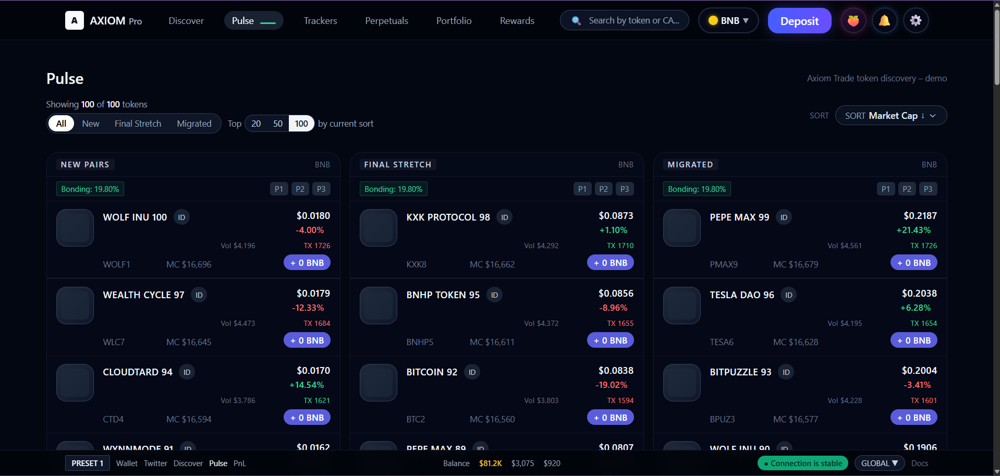
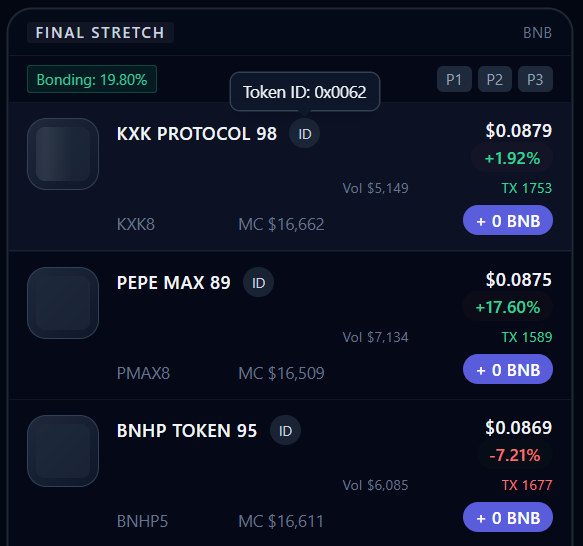

# Axiom Pulse – Token Discovery UI (Clone)

A **replica** of Axiom Trade’s Pulse / token discovery page, built with a modern frontend stack and real-time simulation.

---

## 🧠 Tech Stack

- **Next.js 14 (App Router)**
- **TypeScript (Strict)**
- **Tailwind CSS**
- **Redux Toolkit**
- **React Query**
- **Radix UI / shadcn**
- **WebSocket Mock (for real-time effect)**

---

## 📸 Preview


### Desktop View


### Sorting + Filters


### Table Details Modal


---

## 💻 Local Setup

```bash
git clone https://github.com/lovesd02/axiom-pulse-clone.git
cd axiom-pulse-clone
npm install
npm run dev
